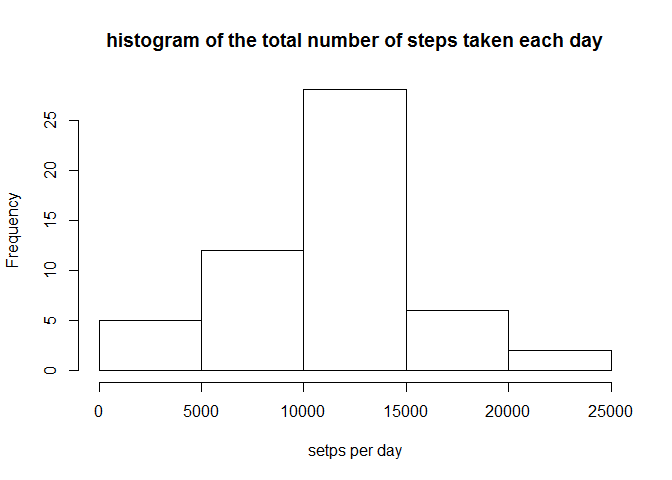
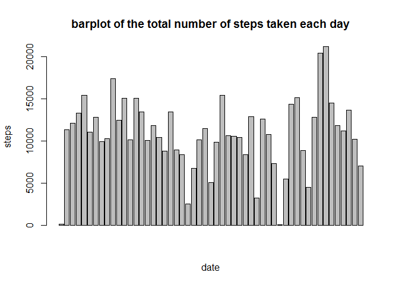
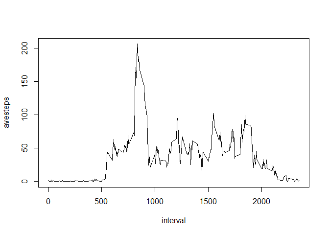
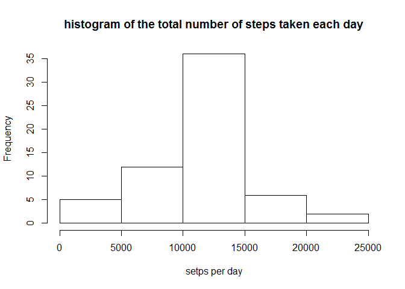
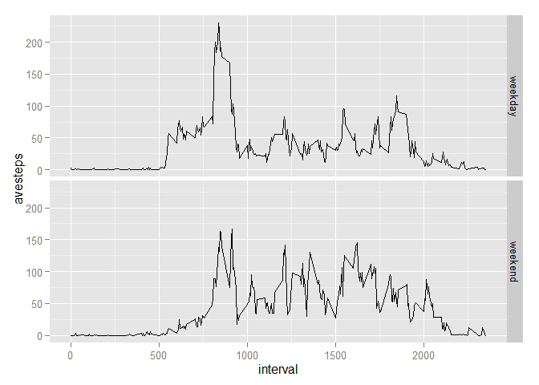

# Reproducible Research: Peer Assessment 1


## Loading and preprocessing the data


```r
library(plyr)
```

```
## Warning: package 'plyr' was built under R version 3.1.3
```

```r
library(ggplot2)
```

```
## Warning: package 'ggplot2' was built under R version 3.1.3
```


```r
activity <- read.csv("activity.csv", stringsAsFactors = FALSE)
head(activity)
```

```
##   steps       date interval
## 1    NA 2012-10-01        0
## 2    NA 2012-10-01        5
## 3    NA 2012-10-01       10
## 4    NA 2012-10-01       15
## 5    NA 2012-10-01       20
## 6    NA 2012-10-01       25
```

```r
str(activity)
```

```
## 'data.frame':	17568 obs. of  3 variables:
##  $ steps   : int  NA NA NA NA NA NA NA NA NA NA ...
##  $ date    : chr  "2012-10-01" "2012-10-01" "2012-10-01" "2012-10-01" ...
##  $ interval: int  0 5 10 15 20 25 30 35 40 45 ...
```

## What is mean total number of steps taken per day?

### 1. Calculate the total number of steps taken per day.

```r
activity_nona <- activity[!is.na(activity['steps']),]
steps_perday <- ddply(activity_nona, .(date), summarize, stepsum=sum(steps))
steps_perday
```

```
##          date stepsum
## 1  2012-10-02     126
## 2  2012-10-03   11352
## 3  2012-10-04   12116
## 4  2012-10-05   13294
## 5  2012-10-06   15420
## 6  2012-10-07   11015
## 7  2012-10-09   12811
## 8  2012-10-10    9900
## 9  2012-10-11   10304
## 10 2012-10-12   17382
## 11 2012-10-13   12426
## 12 2012-10-14   15098
## 13 2012-10-15   10139
## 14 2012-10-16   15084
## 15 2012-10-17   13452
## 16 2012-10-18   10056
## 17 2012-10-19   11829
## 18 2012-10-20   10395
## 19 2012-10-21    8821
## 20 2012-10-22   13460
## 21 2012-10-23    8918
## 22 2012-10-24    8355
## 23 2012-10-25    2492
## 24 2012-10-26    6778
## 25 2012-10-27   10119
## 26 2012-10-28   11458
## 27 2012-10-29    5018
## 28 2012-10-30    9819
## 29 2012-10-31   15414
## 30 2012-11-02   10600
## 31 2012-11-03   10571
## 32 2012-11-05   10439
## 33 2012-11-06    8334
## 34 2012-11-07   12883
## 35 2012-11-08    3219
## 36 2012-11-11   12608
## 37 2012-11-12   10765
## 38 2012-11-13    7336
## 39 2012-11-15      41
## 40 2012-11-16    5441
## 41 2012-11-17   14339
## 42 2012-11-18   15110
## 43 2012-11-19    8841
## 44 2012-11-20    4472
## 45 2012-11-21   12787
## 46 2012-11-22   20427
## 47 2012-11-23   21194
## 48 2012-11-24   14478
## 49 2012-11-25   11834
## 50 2012-11-26   11162
## 51 2012-11-27   13646
## 52 2012-11-28   10183
## 53 2012-11-29    7047
```

### 2. the difference between a histogram and a barplot
A histogram of the total number of steps taken each day

```r
hist(steps_perday$stepsum, 
     main = "histogram of the total number of steps taken each day", 
     xlab = "setps per day")
```

 

A barplot of the total number of steps taken each day

```r
barplot(steps_perday$stepsum, 
        main="barplot of the total number of steps taken each day",
        xlab = "date" , ylab = "steps")
```

 

### 3. Calculate and report the mean and median of the total number of steps taken per day

The mean of the total number of steps taken per day is:

```r
mean(steps_perday$stepsum)
```

```
## [1] 10766.19
```

The median of the total number of steps taken per day is:

```r
median(steps_perday$stepsum)
```

```
## [1] 10765
```

## What is the average daily activity pattern?

### 1. Make a time series plot of the 5-minute interval (x-axis) and the average number of steps taken, averaged across all days (y-axis)


```r
average_steps <- ddply(activity_nona, .(interval), summarize, avesteps = mean(steps))
plot(average_steps, type='l')
```

 

### 2. Which 5-minute interval, on average across all the days in the dataset, contains the maximum number of steps?


```r
sort_ave <- arrange(average_steps,desc(avesteps))
sort_ave[1,]
```

```
##   interval avesteps
## 1      835 206.1698
```
So, interval 835 contains the maximum number of setps.


## Imputing missing values

### 1. Calculate and report the total number of missing values in the dataset (i.e. the total number of rows with NAs)


```r
sum(is.na(activity$steps))
```

```
## [1] 2304
```
The number of missing values is 2304.


### 2. Devise a strategy for filling in all of the missing values in the dataset. The strategy does not need to be sophisticated. For example, you could use the mean/median for that day, or the mean for that 5-minute interval, etc.

We use the the average number of steps for each 5-minute interval to fill in the missing values. 
The value can be gotten from the average_steps datafrme.


### 3. Create a new dataset that is equal to the original dataset but with the missing data filled in.


```r
activity_fill <- activity
for (i in 1:nrow(activity_fill)){
        if (is.na(activity_fill[i,1])){
                intervalid = activity_fill[i,3]
                activity_fill[i,1] = average_steps[average_steps$interval==intervalid,2]
        }
}
head(activity_fill)
```

```
##       steps       date interval
## 1 1.7169811 2012-10-01        0
## 2 0.3396226 2012-10-01        5
## 3 0.1320755 2012-10-01       10
## 4 0.1509434 2012-10-01       15
## 5 0.0754717 2012-10-01       20
## 6 2.0943396 2012-10-01       25
```


### 4. Make a histogram of the total number of steps taken each day and Calculate and report the mean and median total number of steps taken per day. Do these values differ from the estimates from the first part of the assignment? What is the impact of imputing missing data on the estimates of the total daily number of steps?


```r
steps_perday2 <- ddply(activity_fill, .(date), summarize, stepsum=sum(steps))
hist(steps_perday2$stepsum, 
     main = "histogram of the total number of steps taken each day", 
     xlab = "setps per day")
```

 

The mean of the total number of steps taken per day is:

```r
mean(steps_perday2$stepsum)
```

```
## [1] 10766.19
```

The median of the total number of steps taken per day is:

```r
median(steps_perday2$stepsum)
```

```
## [1] 10766.19
```

The mean is the same as the estimate from the first part, because we fill NA with he mean for that 5-minute interval.  
The median is different from the estimate from the first part.  
The media and mean is more closer than that of the first part.  


## Are there differences in activity patterns between weekdays and weekends?

### 1. Create a new factor variable in the dataset with two levels – “weekday” and “weekend” indicating whether a given date is a weekday or weekend day.


```r
activity_new <- activity_fill
activity_new['week'] <- weekdays(as.POSIXct(activity_new[,2]))
for (i in 1:nrow(activity_new)){
        if (activity_new[i,4] == "星期六" || activity_new[i,4] == "星期日"){
                activity_new[i,4] <- "weekend"
        }else{
                activity_new[i,4] <- "weekday"
        }
}
activity_new$week <- factor(activity_new$week)
str(activity_new)
```

```
## 'data.frame':	17568 obs. of  4 variables:
##  $ steps   : num  1.717 0.3396 0.1321 0.1509 0.0755 ...
##  $ date    : chr  "2012-10-01" "2012-10-01" "2012-10-01" "2012-10-01" ...
##  $ interval: int  0 5 10 15 20 25 30 35 40 45 ...
##  $ week    : Factor w/ 2 levels "weekday","weekend": 1 1 1 1 1 1 1 1 1 1 ...
```


### 2. Make a panel plot containing a time series plot (i.e. type = "l") of the 5-minute interval (x-axis) and the average number of steps taken, averaged across all weekday days or weekend days (y-axis). See the README file in the GitHub repository to see an example of what this plot should look like using simulated data.


```r
average_steps2 <- ddply(activity_new, .(week,interval), summarize, avesteps = mean(steps))
qplot(interval,avesteps,data=average_steps2, facets = week~., geom="line" )
```

 

